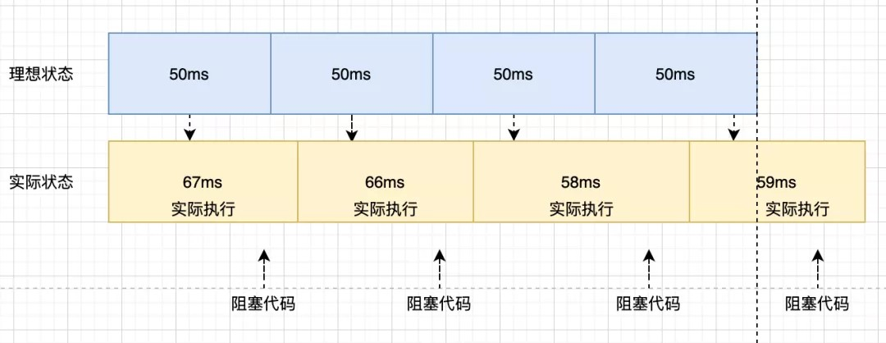
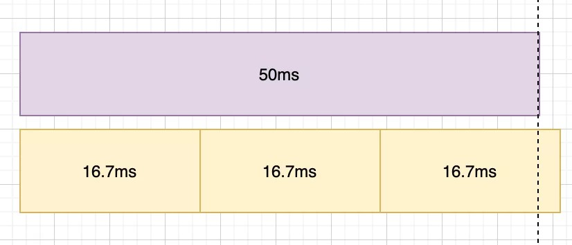

**解决文案一**

使用while true 霸占线程，计算时间间隔来模拟setTimeout

但这样会影响页面假死，不可取

**解决文案二**

使用worker，把while循环搬到worker子线程，不影响页面渲染, 这样子看似完美，但onmessage 还是在事件循环中，还是会使用同步代码影响。
1. worker 线程会被 while 给占用，导致无法接受到信息，多个定时器无法同时执行。
2. 由于 onmessage 还是属于事件循环内，如果主线程有大量阻塞还是会让时间越差越大，因此这并不是个完美的方案。

**解决文案三 requestAnimationFrame**

使用requestAnimationFrame来模拟setTimeout

